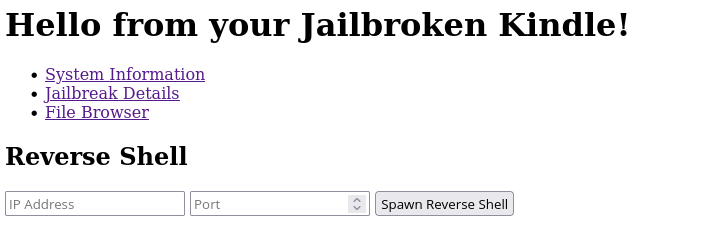
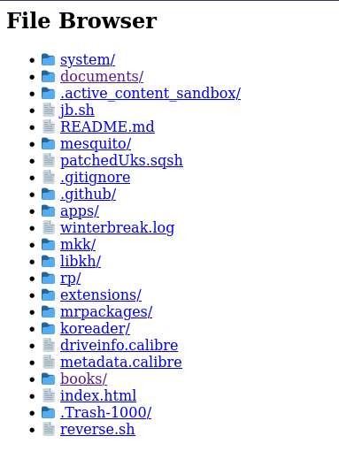

### Kindle Server
Built with axum and meant to run on a very old kindle I have been hacking over spring break.

#### Features
* File Server
* Reverse Shell Launcher (I couldn't get ssh to work on kindle so this is useful)
* Information and Diagnostics Viewing

#### Usage 
1. Plug in your kindle, and mount at /media/USERNAME/Kindle
2. Run ./build.sh
3. Open KUAL launcher and click the Run Server option, and it will start on 0.0.0.0:3000

#### NOTE
This project only works on jailbroken kindles that already have KUAL installed, and you will need the armv7-unknown-linux-musleabihf target toolchain installed

#### Screenshots

