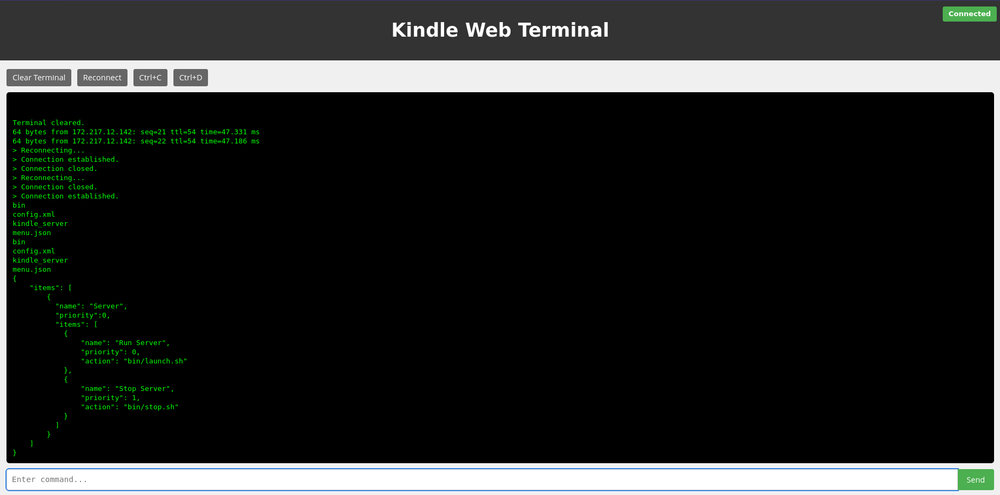
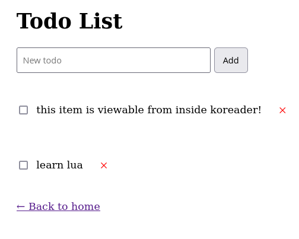

### Kindle Server
Built with axum and meant to run on a very old kindle I have been hacking over spring break.

### Features
* Google Tasks sync.
* Websocket based terminal emulator.
* File Server
* Reverse Shell Launcher (I couldn't get ssh to work on kindle so this is useful)
* Information and Diagnostics Viewing
* Integration with [my Todo-App koreader plugin.](https://github.com/matthewashton-k/todo-koplugin)

### Usage 
#### Google Tasks setup
1. Create a new google apps script and enable the google tasks api and then paste in the code from Code.gs.
2. Deploy it and select "Anyone" for who is allowed to use the deployment.
3. Create launch_server/bin/launch.sh using launch_example.sh as a template, and add modify the SCRIPT_URL variable to hold the google script url for your deployment.

#### Kindle Setup
1. Plug in your kindle, and mount at /media/USERNAME/Kindle
2. Run ./build.sh
3. Open KUAL launcher and click the Run Server option, and it will start on 0.0.0.0:3000 and localhost:3000

#### Koreader plugin integration
1. Download my [todos plugin.](https://github.com/matthewashton-k/todo-koplugin)
2. Create  /mnt/us/koreader/plugins/todo.koplugin/ dir on the Kindle.
3. run ./deploy_kindle.sh
4. Ensure that you launch the kindle server before using the sync to google buttons.

### NOTE
This project only works on jailbroken kindles that already have KUAL installed, and you will need the armv7-unknown-linux-musleabihf target toolchain installed

#### Screenshots

